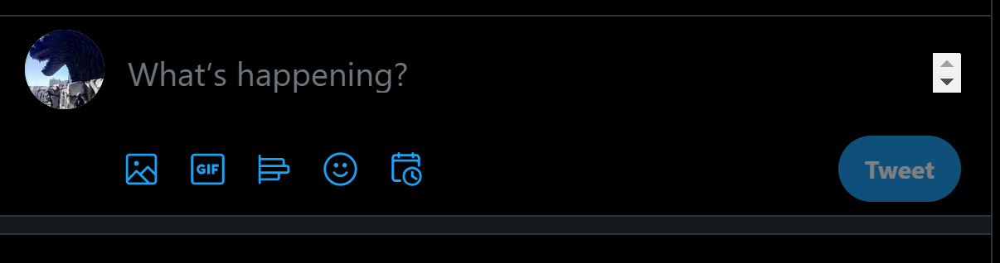
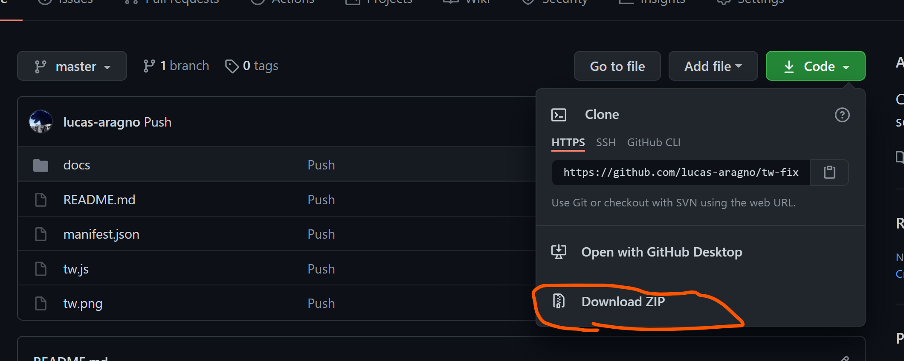
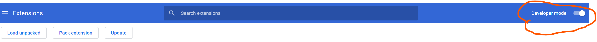
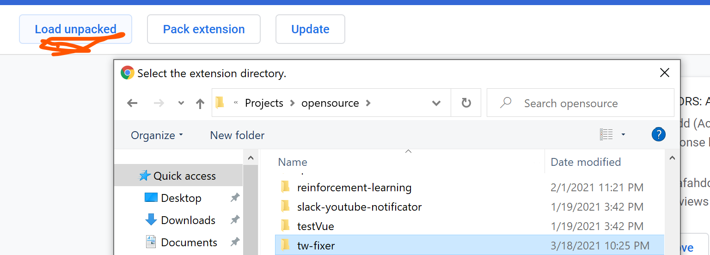
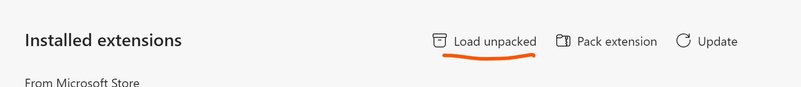
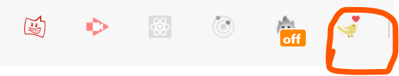

## Twitter Fixer

Chrome extension to fix odd twitter scrollbar:

## How To install it

1 - Download the extension and unzip it:

2 - If you are using Chrome visit [this link](chrome://extensions) (chrome://extensions) , if you are using edge use [this link](edge://extensions) (edge://extensions) instead.

3 - Make sure you have the developer mode on:

4 - Load the extension by clicking "Load unpacked"

on Chrome:

on Edge:

and select the tw-fixer folder.

5 - Once you do that you should see the extension installed on your browser:

6 -  Go and visit twitter again and you should see the tweet box without the scrollbar.
